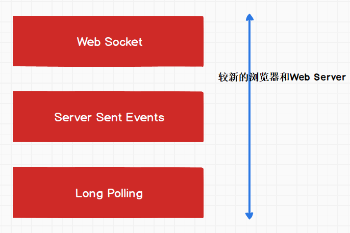
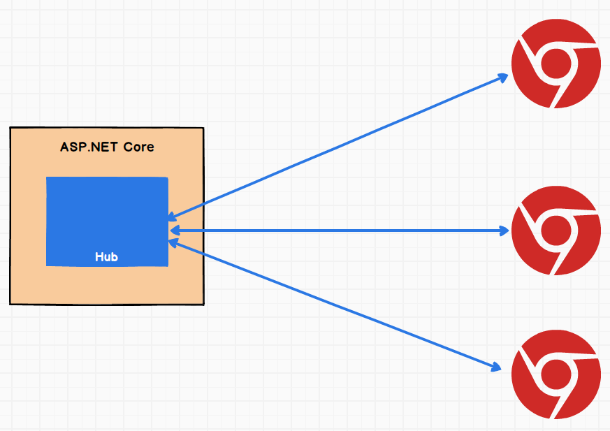

# SignalR牛刀小试

在MVP杨老师的博客里看到这么个东西，我还以为是NetCore3才推出的新玩意，原来是已经有很多年的历史了，那看来还是比较成熟的一个技术了。

## 简介

> SignalR是一个.NET Core/.NET Framework的开源实时框架，SignalR的可使用Web Socket, Server Sent Events 和 Long Polling作为底层传输方式。
>
> SignalR基于这三种技术构建，抽象于它们之上，它让你更好的关注业务问题而不是底层传输技术问题。

以上介绍来自博客，SignalR分为客户端和服务端，服务端运行在AspNetCore上，客户端支持前端、桌面端和移动端，我去查了一下，连Flutter也有相应的支持库。

## 几个概念

### 回落机制

SignalR支持三种底层传输技术，根据客户端的兼容性可以自动协商传输类型。如图

 

 Web Socket是最好的最有效的传输方式，如果浏览器或Web服务器不支持它的话，就会降级使用SSE，实在不行就用Long Polling。

### RPC

不用解释太多，Remote Procedure Call，SignalR采用RPC范式来进行服务端和客户端之间的通信。

### Hub

 Hub是SignalR的一个组件，运行在服务端，它是一个通信用的组件， Hub使用RPC接受从客户端发来的消息，也能把消息发送给客户端 。

 

### 关于横向扩展

SignalR针对多种底层通信方式有了 **Sticky Sessions (粘性会话)** 这种解决方案，可以保证一个客户端在一次会话中的请求都分配给同一个服务器，具体以后需要的时候再研究。

## 开始使用

我要做的是一个聊天室，所以只需要写一个简单的服务就可以了。

首先要创建AspNetCore项目，注册SignalR服务：

```c#
public void ConfigureServices(IServiceCollection services)
{
    services.AddControllers();
    services.AddSignalR();
}
```

创建`ChatService`类：

```c#
public class ChatService
{
    private readonly List<ChatMessage> _messages;
    private readonly IHubContext<ChatHub> _context;
    public List<ChatMessage> Messages { get => _messages; }
    public ChatService(IHubContext<ChatHub> context)
    {
        _context = context;
        _messages = new List<ChatMessage>();
    }
}
```

消息实体类：

```c#
public class ChatMessage
{
    public string UserName { get; set; }
    public string Content { get; set; }
    public DateTime SendedTime { get; set; }
    public string ClientName { get; set; }
}
```

关键的来了，编写Hub：

使用`SendAsync`可以进行远程调用

```c#
public class ChatHub : Hub {
    private readonly ChatService _chatService;
    public ChatHub(ChatService chatService) {
        _chatService = chatService;
    }
    public async Task GetMessages(string connectionId) {
        var data = _chatService.Messages;
        await Clients.Client(connectionId).
            SendAsync("GetMessages", data);
    }
    public async Task SendMessage(string userName, string content, string clientName) {
        var msg = new Models.ChatMessage {
            UserName = userName,
            Content = content,
            SendedTime = DateTime.Now,
            ClientName = clientName
        };
        _chatService.Messages.Add(msg);
        await Clients.All.SendAsync("SendMessage", msg);
    }
    public override Task OnConnectedAsync() {
        GetMessages(Context.ConnectionId);
        return base.OnConnectedAsync();
    }
}
```

## 注册依赖注入和中间件

依赖注入

```c#
public void ConfigureServices(IServiceCollection services)
{
    services.AddControllers();
    services.AddSignalR();
    services.AddSingleton<CountService>();
    services.AddSingleton<ChatService>();
}
```

中间件

```c#
public void Configure(IApplicationBuilder app, IWebHostEnvironment env)
{
    app.UseStaticFiles();
    app.UseRouting();
    app.UseEndpoints(endpoints =>{
        endpoints.MapControllers();
        endpoints.MapHub<ChatHub>("/chat");
    });
}
```

## 客户端

为了方便我就用网页来做。

首先写个简单的聊天界面布局，这里就不贴代码了，效果大概这样：